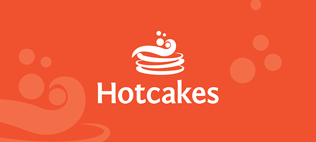

Project Description
==================
At Hotcakes Commerce, we believe that e-commerce should be easy for everyone on your team.  This open source e-commerce solution delivers on that promise.

Hotcakes Commerce is an enterprise-ready e-commerce CMS that empower store owners, developers, and designers.  It allows you to easily get a store up and running, integrate it with any of your custom and third party systems, while helping run your entire company's online web presence.  We've been told that it's "my company, in a box."

In addition to being a robust open source e-commerce CMS, Hotcakes Commerce includes the following built-in features:

* A rich-text editor
* File management
* Cloud-ready with MS Azure compatibility
* Mobile API and basic mobile device detection
* Core written in C#
* Single installation, multiple portals
* Modern client-side Web tools like CSS 3, HTML 5 and JQuery
* Robust security
* Administration features like: security roles, protected content and site log

Project: QA
-----------
This solution is used to smoke test an installed instance of Hotcakes Commerce before any release to ensure that there are no new issues created as a result of changes made to the core or cms Hotcakes solutions.

On occassion, this solution may need to be updated to reflect new features in the core or cms of Hotcakes, such as the UI changing.

Quick Links
-----------
* [Hotcakes on Facebook](http://www.facebook.com/HotcakesCommerce)
* [Community](https://hotcakescommerce.com/Community)
* [Resources](https://hotcakescommerce.com/Resources)

How to Contribute
-----------------
We encourage everyone to contribute.
All the details on contributing with Git and on our working methods can be found here in the wiki.
